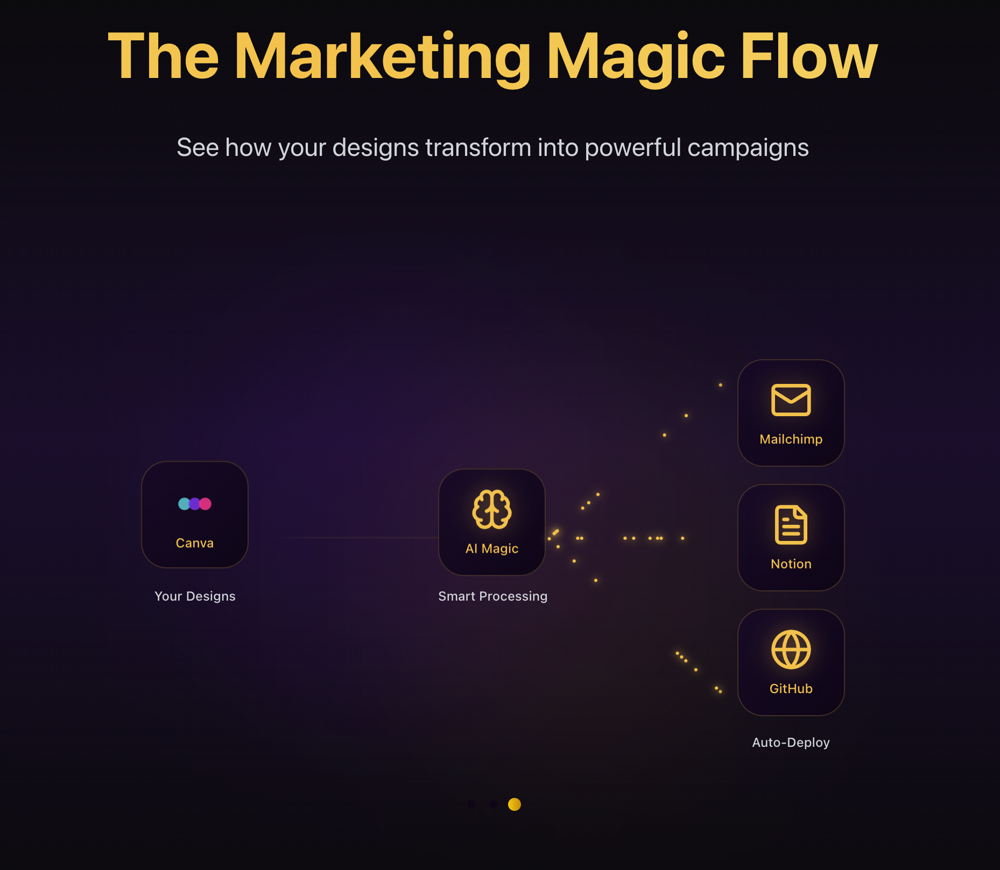

# Marketing Automator



## What is Marketing Automator?

Marketing Automator is a platform that connects your favorite design and marketing tools to create professional campaigns in minutes. Simply pick a design from Canva, describe your campaign, and let our AI agents handle the rest - from writing compelling copy to building beautiful landing pages and sending emails.

Perfect for small businesses, marketers, and anyone who wants to create professional marketing campaigns without the hassle of juggling multiple tools.

## 🚀 Setting Up Locally

### Prerequisites
- Node.js 18.x or higher
- npm 9.x or higher
- Git

### Step 1: Clone and Install
```bash
git clone https://github.com/yourusername/market-automator.git
cd market-automator
npm install

# If you encounter Tailwind errors:
npm rebuild
```

### Step 2: Create a Supabase Project
1. Sign up at [Supabase](https://supabase.com)
2. Create a new project
3. Save your project URL and keys

### Step 3: Set Up Your Database
```bash
# Install Supabase CLI
npm install -g supabase

# Initialize Supabase
supabase init

# Link to your project
supabase link --project-ref your-project-ref

# Run migrations
supabase db push
```

### Step 4: Configure Environment
Create a `.env.local` file:

```env
# Supabase
NEXT_PUBLIC_SUPABASE_URL=https://your-project.supabase.co
NEXT_PUBLIC_SUPABASE_ANON_KEY=your-anon-key
SUPABASE_SERVICE_ROLE_KEY=your-service-role-key

# Canva OAuth
NEXT_PUBLIC_CANVA_CLIENT_ID=your-canva-client-id
CANVA_CLIENT_SECRET=your-canva-client-secret
CANVA_REDIRECT_URI=http://127.0.0.1:3000/api/auth/callback/canva

# App URL - MUST use 127.0.0.1
NEXT_PUBLIC_APP_URL=http://127.0.0.1:3000
```

**Important**: Always use `127.0.0.1` instead of `localhost` to avoid connection issues.

### Step 5: Set Up Canva
1. Visit [Canva Developers](https://www.canva.com/developers)
2. Create a new app
3. Add this redirect URI: `http://127.0.0.1:3000/api/auth/callback/canva`
4. Copy your Client ID and Secret to `.env.local`

### Step 6: Start the App
```bash
npm run dev
```

Open `http://127.0.0.1:3000` in your browser.

## 🔑 Getting Started (For Users)

Once you've logged in, you'll need to connect your accounts. Go to Settings and add:

### 1. OpenAI API Key
- Get it from [OpenAI Platform](https://platform.openai.com/api-keys)
- Powers the AI agents that create your content

### 2. Canva Account
- Click "Connect Canva" to link your account
- This lets you use your Canva designs

### 3. Notion API Token
- Get it from [Notion Integrations](https://www.notion.so/my-integrations)
- Creates a database to track your campaigns

### 4. GitHub Personal Access Token
- Create one at [GitHub Settings](https://github.com/settings/tokens)
- Needed to publish landing pages
- Select permissions: `repo` and `workflow`

### 5. Mailchimp API Key
- Find it at [Mailchimp Account](https://admin.mailchimp.com/account/api/)
- Also need your server prefix (e.g., us21)
- Sends your email campaigns

## 🤖 Meet Your AI Team

Marketing Automator uses four specialized AI agents that work together to create your campaigns:

### Brand Agent
Handles the visual side of things - picks colors that work well together, suggests fonts, and ensures everything looks consistent with your brand.

### Content Agent
Your copywriter - creates headlines, writes compelling descriptions, and crafts calls-to-action that convert. It adapts the tone and style based on your campaign goals.

### Technical Agent
The builder - takes the design and content and turns them into actual emails and web pages. Handles all the HTML, CSS, and makes sure everything displays correctly.

### Orchestrator Agent
The project manager - coordinates the other agents, reviews their work, and suggests improvements. Makes sure everything works together seamlessly.

## 🏗️ How Our Code is Organized

Understanding our project structure helps you navigate and contribute:

### `/app/api`
Contains all the backend logic:
- Integration endpoints (Canva, Notion, GitHub, Mailchimp)
- AI agent orchestration
- Campaign management APIs

### `/app/components`
Reusable UI elements:
- Forms, buttons, cards
- Dashboard widgets
- Settings panels

### `/app/services`
Business logic layer:
- AI agent implementations
- Integration service classes
- Data processing utilities

### `/app/campaigns`
Campaign management interface:
- Creation wizard
- Analytics dashboard
- Campaign list and details

### `/app/dashboard`
Main dashboard:
- Canva design browser
- Quick actions
- Overview statistics

### `/supabase`
Database layer:
- Table schemas
- Row Level Security policies
- Encrypted API key storage

## 📊 Creating Your First Campaign

1. **Go to Dashboard** - See all your Canva designs organized by type
2. **Pick a Design** - Click "Distribute Campaign" on any design
3. **Describe Your Goal** - Tell the AI what you want to achieve
4. **Choose Format** - Email, landing page, Notion Database
5. **Review & Customize** - Edit the AI-generated content if needed
6. **Launch** - Send emails and publish landing pages with one click

---